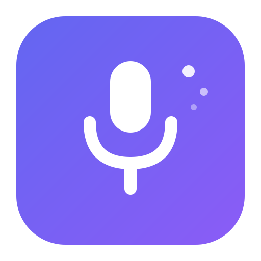

<p align="center">
  
</p>

<h1 align="center">TalkAI</h1>

<p align="center">
  A lightweight macOS menu bar utility that adds AI-powered text cleanup to voice input — completely local, no servers, no data leaving your device.
</p>

<p align="center">
  Press a hotkey, speak, press again. Your speech is transcribed and polished by AI, then pasted into whatever app you're using.
</p>

---

## Install

### Download DMG

Download the latest `.dmg` from [GitHub Releases](https://github.com/rameshvr/talkai/releases), open it, and drag TalkAI to Applications.

> On first launch, macOS may show a security warning because the app isn't notarized. **Right-click the app and choose "Open"** to proceed. This only happens once.

### Homebrew

```bash
brew tap rameshvr/talkai
brew install --cask talkai
```

### Build from Source

```bash
git clone https://github.com/rameshvr/talkai.git
cd talkai
./build-app.sh
open .build/app/TalkAI.app
```

Requires Xcode 26 and macOS 26.

## How It Works

TalkAI uses two Apple frameworks that run entirely on your device:

- **SpeechTranscriber** — Apple's on-device speech-to-text engine
- **Foundation Models** — Apple's on-device ~3B parameter LLM (the same one powering Apple Intelligence)

No audio or text ever leaves your Mac.

## Usage

1. Press **Right ⌥ Option** to start recording
2. Speak naturally
3. Press **Right ⌥ Option** again to stop
4. Your polished text is automatically pasted into the focused app
5. Press **ESC** at any time to cancel

## Requirements

- macOS 26 or later
- Apple Silicon (M1 or later)
- Apple Intelligence enabled (System Settings → Apple Intelligence & Siri)

## Permissions

On first launch, TalkAI will ask for:

| Permission | Why |
|---|---|
| **Microphone** | To capture your speech |
| **Accessibility** | For global hotkey capture and paste simulation |

To grant Accessibility access: **System Settings → Privacy & Security → Accessibility → Enable TalkAI**

## Settings

Access settings from the menu bar icon:

- **Language** — Choose transcription language (10 languages supported)
- **AI Cleanup Prompt** — Customize how the AI polishes your text
- **History** — View and re-copy recent transcriptions

## Architecture

```
TalkAICore/          # Reusable Swift package (iOS-ready)
├── SpeechService    # On-device speech-to-text
├── PolishService    # On-device LLM text cleanup
└── Pipeline         # Orchestrator

TalkAI/              # macOS app
├── HotkeyManager    # Global hotkey (CGEvent)
├── PasteManager     # Clipboard + Cmd+V simulation
├── RecordingOverlay # Floating status indicator
└── Settings         # Configuration UI
```

## License

MIT
